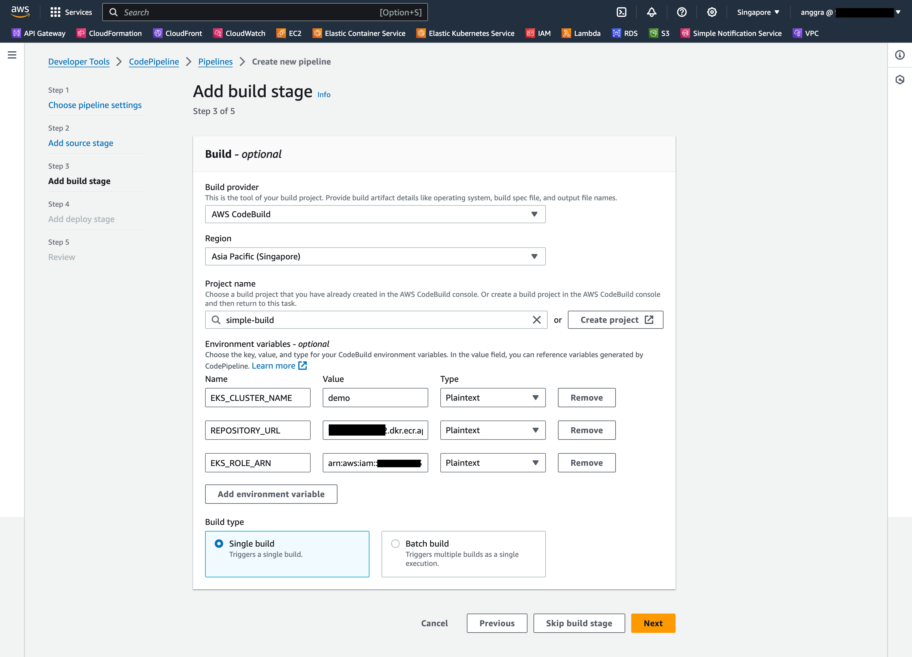

# Example Go EKS Simple Pipeline

This repository provides a sample Go application CI/CD deployment on EKS

## Table of Contents:

## Tools
Useful tools to manage EKS:
- [kubectl](https://kubernetes.io/docs/reference/kubectl/)
- [eksctl](https://eksctl.io) 
- [AWS Command Line Interface (CLI)](https://aws.amazon.com/cli/)

## Deployment Manifest File
We specify the container image in the deployment manifest file [deployment.yml](manifests/deployment.yml) using `CONTAINER_IMAGE` which will be replaced to the actual container image by the build script during build process.

## Create IAM Role for CodeBuild to interact with EKS
Create an IAM Role for CodeBuild so that it can interact with EKS, with the following trust policy:
```json
{
    "Version": "2012-10-17",
    "Statement": [
        {
            "Effect": "Allow",
            "Principal": {
                "AWS": "arn:aws:iam::<AWS_ACCOUNT_ID>:root"
            },
            "Action": "sts:AssumeRole"
        }
    ]
}
```
and the following permission
```json
{
    "Version": "2012-10-17",
    "Statement": [
        {
            "Effect": "Allow",
            "Action": "eks:Describe*",
            "Resource": "*"
        }
    ]
}
```
For this example, the IAM Role will be named `CodeBuildEKSRole`.

## Add the CodeBuildEKSRole role to aws-auth configmap
Update the `aws-auth` configmap in `kube-system` namespace with
```sh
kubectl edit configmap aws-auth --namespace kube-system
```
and add
```yaml
    - rolearn: arn:aws:iam::<AWS_ACCOUNT_ID>:role/CodeBuildEKSRole
      username: codebuild
      groups:
        - system:masters
```
to `data.mapRoles`

## Prepare buildspec.yml
To specify the build commands to be run by CodeBuild, a [buildspec.yml](buildspec.yml) file can be created. 

In summary, the commands defined in [buildspec.yml](buildspec.yml) will perform the following:
1. [Replace `CONTAINER_IMAGE` in deployment manifest to the Docker image with tag](buildspec.yml?#L14)
2. [Login to Amazon ECR Registry](buildspec.yml?#L20)
3. [Build the Docker image for the application](buildspec.yml?#L29)
4. [Push the Docker image to the ECR Repository](buildspec.yml?#L35)
5. [Update kubeconfig to use the designated EKS cluster](buildspec.yml?#L39)
6. [Apply the manifests](buildspec.yml?#L42)

## Setting Up CodePipeline
### Create the pipeline with a new IAM Service Role


### Add the Source stage (in this example is GitHub)


### Add the Build stage


#### The CodeBuild Build project needs to be created


Build environment configurations:
- **Environment image**: `Managed image`
- **Operating system**: `Amazon Linux`
- **Runtime**: `Standard`
- **Image**: `aws/codebuild/amazonlinux2-x86_64-standard:4.0`
- **Privileged**: ✅ *Enable this flag if you want to build Docker Images or want your builds to get elevated privileges*
- **Service role**: 🔵 *New service role*, in this example, the **Role name** is using the automatically provided name: `codebuild-simple-build-service-role`
- **Buildspec**: 🔵 *Use a buildspec file*, **Buildspec name**: `buildspec.yml`

### Add Environment Variables to the Build stage
Back in the Build stage configuration of CodePipeline, provide the environment variables:
- **EKS_CLUSTER_NAME**
- **REPOSITORY_URL**
- **EKS_ROLE_ARN**, (`arn:aws:iam::<AWS_ACCOUNT_ID>:role/CodeBuildEKSRole`) 

Review and then click *Create pipeline*.

## Create IAM Policy for CodeBuild to assume CodeBuildEKSRole
Create an IAM Policy named `codebuild-eks-sts-role` with the following policy:
```json
{
    "Version": "2012-10-17",
    "Statement": [
        {
            "Effect": "Allow",
            "Action": "sts:AssumeRole",
            "Resource": "arn:aws:iam::<AWS_ACCOUNT_ID>:role/CodeBuildEKSRole"
        }
    ]
}
```

Attach `codebuild-eks-sts-role` IAM Policy to `codebuild-simple-build-service-role` Role.
`AmazonEC2ContainerRegistryFullAccess` IAM Policy may also need to be attached so that CodeBuild is able to push to the ECR registry.
 

Once done, the pipeline should be ready and any commit to the `master` branch will trigger the pipeline process.

## References
[^1] CI/CD Pipeline for EKS using CodeCommit, CodeBuild, CodePipeline, and Elastic Container Registry(ECR) https://devopslearning.medium.com/ci-cd-pipeline-for-eks-using-codecommit-codebuild-codepipeline-and-elastic-container-100f4b85e434

[^2] DevOps with AWS CodePipeline on AWS EKS https://www.stacksimplify.com/aws-eks/aws-devops-eks/learn-to-master-devops-on-aws-eks-using-aws-codecommit-codebuild-codepipeline/ 